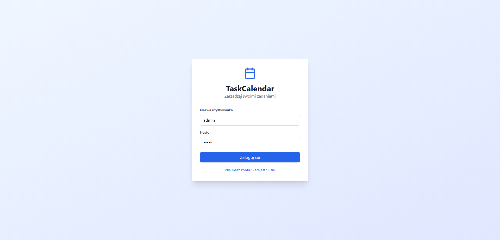
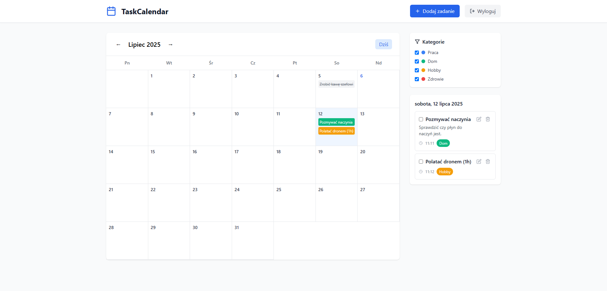
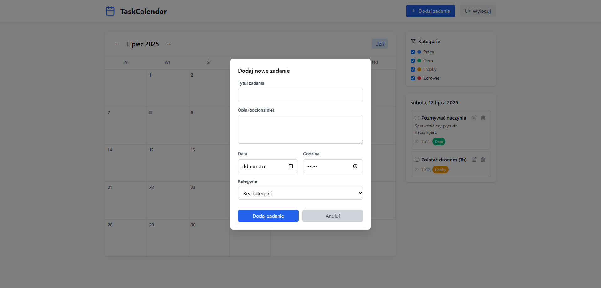

# TaskCalendar

TaskCalendar to aplikacja webowa. Służy do zarządzania zadaniami i kategoriami. Jest możliwość planowania dat i godzin

---

## 🛠️ Funkcjonalności

-  Rejestracja i logowanie użytkownika (JWT)
- Tworzenie, edycja i usuwanie zadań
-  Przypisywanie zadań do kategorii
-  Oznaczanie zadań jako ukończone
-  Filtracja zadań według daty lub kategorii
-  Responsywny interfejs użytkownika (React + Tailwind CSS)

---

## 💻 Technologie

- **Backend:** FastAPI, SQLAlchemy, SQLite
- **Frontend:** React, Tailwind CSS, Nginx
- **Autoryzacja:** JWT, passlib
- **Konteneryzacja:** Docker, Docker Compose

---

## 🚀 Instrukcja uruchomienia

### Wymagania

- Docker
- Docker Compose

### Instrukcja uruchomienia

```bash
git clone https://github.com/marek7812/7812-semproj-chmury
cd TaskCalendar
docker-compose up --build
```

- Frontend: `http://localhost:3000`
- Backend API: `http://localhost:8000`

---

## 🔌 API – Główne endpointy

- `POST /register` – rejestracja
- `POST /login` – logowanie (JWT)
- `GET /tasks` – pobranie listy zadań
- `POST /tasks` – dodanie zadania
- `PUT /tasks/{id}` – edycja zadania
- `DELETE /tasks/{id}` – usunięcie zadania
- `GET /categories` – lista kategorii
- `POST /categories` – dodanie kategorii

---

## 🖼️ Zrzuty ekranu

### Ekran logowania



### Lista zadań



### Formularz dodawania zadania


